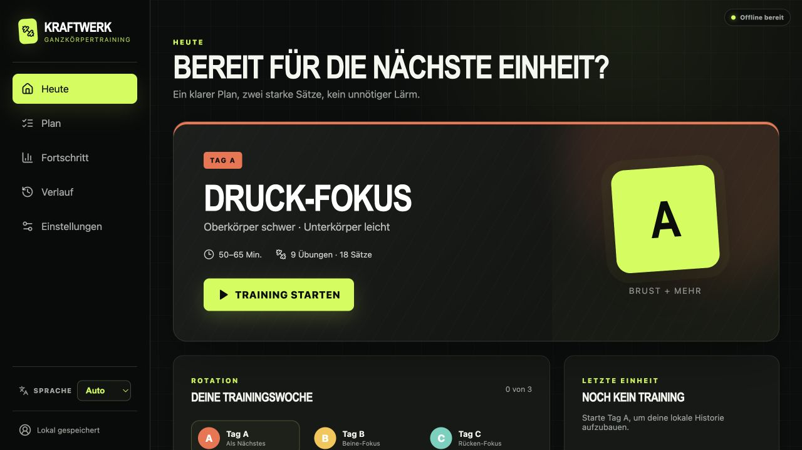
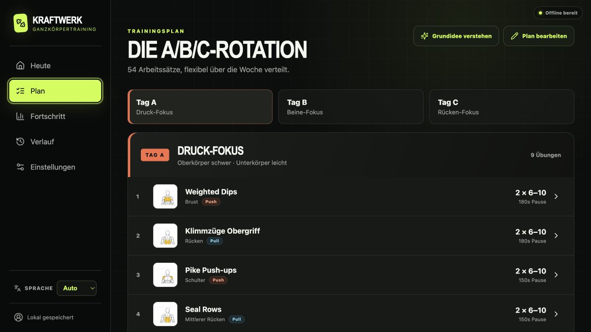
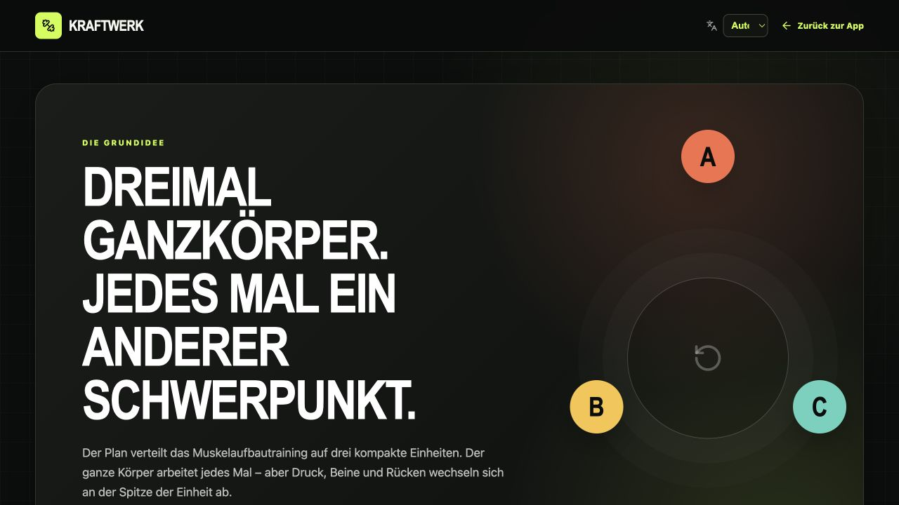

# Kraftwerk – Ganzkörpertraining

[](https://kraftwerk-training.pages.dev/)
[](https://github.com/Dandiccf/ganzkoerper-training-app/actions/workflows/ci.yml)
[](LICENSE)

**Kraftwerk** ist eine installierbare, local-first entwickelte Trainings-PWA für eine flexible Ganzkörper-A/B/C-Rotation. Drei kompakte Einheiten trainieren jeweils den ganzen Körper, während Druck, Beine und Rücken abwechselnd priorisiert werden.

Die App ist für die praktische Nutzung im Gym gebaut: Übungen lassen sich spontan umsortieren oder austauschen, die Satzanzahl bleibt flexibel, Pausen und laufende Trainings werden zuverlässig gespeichert und der Fortschritt wird über Wochen und Monate sichtbar gemacht.

## Direkt ausprobieren

**[Kraftwerk jetzt kostenlos im Browser öffnen](https://kraftwerk-training.pages.dev/)**

Es ist kein Konto erforderlich. Trainingsdaten bleiben standardmäßig lokal im Browser und können jederzeit als JSON oder CSV exportiert werden. Die PWA lässt sich auf unterstützten Geräten installieren und nach dem ersten vollständigen Laden offline verwenden.

> **Keine Trainingsdaten in der Cloud:** Kraftwerk selbst enthält kein Tracking, keine Analytics, keine Werbung und keine serverseitige Datenbank. Trainingsverlauf, Plananpassungen und Einstellungen bleiben ausschließlich im verwendeten Browser auf dem Endgerät. Für einen Gerätewechsel steht ein vollständiger JSON-Export mit anschließendem Import zur Verfügung.

## Screenshots

| Heute und nächste Einheit | Flexibler A/B/C-Trainingsplan |
| --- | --- |
|  |  |



## Die Grundidee

Der Plan verteilt hypertrophieorientiertes Ganzkörpertraining auf drei Einheiten mit wechselndem Schwerpunkt:

| Einheit | Schwerpunkt | Schwerer Bereich | Leichterer Bereich |
| --- | --- | --- | --- |
| **A** | Druck-Fokus | Oberkörper, meist 6–10 Wiederholungen | Unterkörper, meist 15–25 Wiederholungen |
| **B** | Beine-Fokus | Unterkörper, meist 6–10 Wiederholungen | Oberkörper, meist 15–25 Wiederholungen |
| **C** | Rücken-Fokus | Oberkörper-Zugbewegungen, meist 6–10 Wiederholungen | Unterkörper und ergänzende Druckarbeit |

Standardmäßig sind zwei konzentrierte Arbeitssätze pro Übung und etwa ein bis zwei Wiederholungen im Tank vorgesehen (**RIR 1–2**). Zwischen den Einheiten liegen normalerweise ein bis zwei Ruhetage. Die Rotation läuft weiter, auch wenn ein geplanter Wochentag ausfällt.

Der Plan ist ein Rahmen und kein starres Dogma: Übungsreihenfolge, Alternativen und Satzanzahl können dauerhaft im Masterplan oder spontan während einer laufenden Einheit angepasst werden.

## Features

### Training im Gym

- A/B/C-Rotation mit automatischer Empfehlung für die nächste Einheit
- freie Übungsreihenfolge, wenn Geräte oder Stationen belegt sind
- spontane und dauerhafte Übungsalternativen je Muskel- und Bewegungsslot
- flexible Satzanzahl: Sätze hinzufügen oder entfernen
- Erfassung von Gewicht, Wiederholungen und RIR
- Satzpausen mit persistentem Timer
- sichere Pause und Wiederaufnahme laufender Trainings nach Reload oder Browser-Neustart
- Bearbeiten und Löschen protokollierter Sätze mit Rückgängig-Funktion

### Plan und Personalisierung

- 27 kuratierte Planübungen mit Muskelgruppe und Bewegungsprofil
- Push-, Pull-, Beine- und Core-Kennzeichnung in Übungslisten
- Masterplan-Editor zum Sortieren, Entfernen und Ergänzen von Übungen
- alternative Übungen mit stabiler Satz- und Wiederholungsvorgabe
- echte kg/lb-Konvertierung und konfigurierbare Gewichtsschritte
- Deutsch und Englisch mit automatischer Browser-Spracherkennung

### Fortschritt und Daten

- Analysen für acht Wochen, sechs Monate oder den gesamten Zeitraum
- Volumen- und Satztrends
- Progression je Übung
- Verteilung nach Muskelgruppen und Bewegungsmustern
- lokale Trainingshistorie und Progressionsempfehlungen
- versionierter JSON-Export und -Import für Verlauf, Plan, Alternativen und Einstellungen
- zusätzlicher CSV-Export

### Local-first PWA

- keine Registrierung und kein zwingendes Backend
- persistente Speicherung in IndexedDB über Dexie
- installierbare, responsive Oberfläche für Smartphone, Tablet und Desktop
- Service Worker mit vorgecachter App-Shell und kontrolliertem Update-Flow
- vollständige Bedienbarkeit eines geladenen Trainings bei schlechtem oder fehlendem Netz

## Credits und konzeptionelle Quelle

Die zentrale Inspiration für die Trainingsmethode ist das YouTube-Video **[„MEHR MUSKELN in WENIGER ZEIT (kompletter Trainingsplan)“](https://www.youtube.com/watch?v=I7UtSo0NTaA)** von **[Dennis Ratano](https://www.youtube.com/@DennisRatano2)**.

Kraftwerk überführt die dort erklärte Grundidee in eine unabhängige, local-first entwickelte Trainings-App mit flexibler Planung, Protokollierung und Fortschrittsanalyse. Dieses Projekt ist nicht mit Dennis Ratano oder YouTube verbunden und wird von ihnen nicht offiziell unterstützt. Das Video und der Kanal bleiben Eigentum ihrer jeweiligen Rechteinhaber und sind nicht Bestandteil dieses Repositories.

Weitere Hintergründe zur Methode und zu den verwendeten Trainingsprinzipien stehen auf der **[Grundidee-Seite der App](https://kraftwerk-training.pages.dev/grundidee)**.

## Schnellstart für Entwickler

Voraussetzungen:

- Node.js 22 oder neuer
- npm

```bash
git clone https://github.com/Dandiccf/ganzkoerper-training-app.git
cd ganzkoerper-training-app
npm ci
npm run dev
```

Die Entwicklungsumgebung ist anschließend unter [http://localhost:3000](http://localhost:3000) erreichbar.

## Wichtige Befehle

| Befehl | Zweck |
| --- | --- |
| `npm run dev` | lokale Entwicklungsumgebung starten |
| `npm run validate:data` | Trainings- und Alternativdaten validieren |
| `npm run lint` | ESLint ausführen |
| `npm run typecheck` | TypeScript prüfen |
| `npm test` | automatisierte Tests ausführen |
| `npm run build` | normalen Produktions-Build erzeugen |
| `npm run check` | Lint, TypeScript, Tests und Build gemeinsam ausführen |
| `make cloudflare-build` | statischen Cloudflare-Pages-Build erzeugen |
| `make cloudflare-deploy` | bauen und auf Cloudflare Pages veröffentlichen |

## Cloudflare Pages Deployment

Die öffentliche PWA läuft als statischer Next.js-Export im separaten Cloudflare-Pages-Projekt `kraftwerk-training`:

```bash
make cloudflare-status
make cloudflare-deploy
```

Falls auf dem Rechner noch keine Cloudflare-Anmeldung vorhanden ist:

```bash
make cloudflare-login
```

Das [Makefile](Makefile) enthält keine Zugangsdaten. Wrangler speichert die lokale Anmeldung außerhalb des Repositories. API-Tokens oder andere Secrets dürfen niemals in Git eingecheckt werden. Die npm-Befehle `npm run build:cloudflare` und `npm run deploy:cloudflare` bleiben alternativ direkt verwendbar.

Ein Git-Push allein löst bei diesem Direct-Upload-Projekt kein Cloudflare-Deployment aus.

## Daten und Privatsphäre

Kraftwerk verfolgt einen konsequenten Local-first-Ansatz:

- kein Benutzerkonto und keine Anmeldung;
- keine serverseitige Trainingsdatenbank und kein Cloud-Sync;
- keine Analytics, Telemetrie, Werbung oder Tracking-Cookies durch die App;
- kein Upload von Trainings-, Körper- oder Gesundheitsdaten;
- Speicherung von Trainingseinheiten, Entwürfen, Timern, Plananpassungen und Einstellungen ausschließlich in IndexedDB beziehungsweise lokalem Browserspeicher auf dem Endgerät.

Beim Aufruf der Online-App wird die Website technisch über Cloudflare Pages ausgeliefert. Cloudflare kann dabei notwendige Verbindungs- und Verkehrsdaten wie IP-Adresse, Routingdaten oder Systeminformationen verarbeiten. Diese technischen Hostingdaten sind von den lokal gespeicherten Trainingsdaten getrennt; Kraftwerk übermittelt keine Trainingsinhalte an Cloudflare. Einzelheiten beschreibt die [Datenschutzerklärung von Cloudflare](https://www.cloudflare.com/policies/privacy/).

### Wechsel auf ein anderes Gerät

Für eine vollständige Übertragung wird das **JSON-Backup** verwendet:

1. Auf dem bisherigen Gerät unter **Einstellungen & Daten** auf **JSON exportieren** klicken.
2. Die erzeugte Datei sicher auf das neue Gerät übertragen.
3. Kraftwerk auf dem neuen Gerät öffnen und unter **Einstellungen & Daten** **JSON importieren** wählen.
4. Den Import bestätigen. Er ersetzt den eventuell bereits vorhandenen lokalen Datenbestand in diesem Browser.

Das JSON-Backup enthält Trainingsverlauf, laufende oder pausierte Sitzungen samt Entwürfen und Timer, den angepassten Masterplan, Übungsalternativen, Sprache sowie Einheiten- und Gewichtseinstellungen. Der CSV-Export ist nur zur tabellarischen Auswertung gedacht und kann keinen vollständigen App-Zustand wiederherstellen.

Dadurch gilt:

- verschiedene Browser, Geräte und Domains besitzen getrennte lokale Datenbestände;
- ein Wechsel von `localhost` zur öffentlichen `pages.dev`-Adresse benötigt einen JSON-Export und anschließenden Import;
- das Löschen der Website-Daten im Browser kann lokale Trainingsdaten entfernen;
- regelmäßige JSON-Backups sind empfehlenswert;
- die JSON-Datei ist unverschlüsselt und sollte wie ein persönliches Trainingsprotokoll vertraulich behandelt werden.

## Projektstruktur

```text
ganzkoerper-training-app/
├── app/                    # Next.js App Router, Styles und Manifest
├── data/                   # versionierter Trainingsplan und Alternativen
├── docs/                   # Produkt-, Datenmodell- und Roadmap-Dokumentation
│   └── screenshots/        # aktuelle Screenshots für die Projektdokumentation
├── public/                 # PWA- und Muskelgruppen-Assets
├── src/
│   ├── components/         # App-Shell, Planung, Training und Analysen
│   └── lib/                # Domänenlogik, Schema, Backups und IndexedDB
├── tools/                  # Datenvalidierung und PDF-Generator
├── Makefile                # Cloudflare-Build und Deployment
└── LICENSE                 # MIT-Lizenz
```

Weiterführende Dokumentation:

- [Produkt- und Umsetzungsplan](docs/APP_PLAN.md)
- [Datenmodell](docs/DATA_MODEL.md)
- [Übungsalternativen](docs/EXERCISE_SUBSTITUTIONS.md)
- [Roadmap](docs/ROADMAP.md)
- [Druckbares Trainingshandbuch](pdf/Trainingsplan-Ganzkoerper-3-Tage.pdf)

## Technik

- Next.js 16 mit App Router und React 19
- TypeScript im Strict Mode
- Dexie und IndexedDB für lokale Persistenz
- Zod für Laufzeitvalidierung und sichere Backup-Imports
- Vitest mit Domänen-, Migrations- und IndexedDB-Integrationstests
- ESLint und GitHub Actions als Qualitätsbarrieren
- Cloudflare Pages für das statische Hosting

## Mitwirken

Beiträge, Fehlerberichte und Ideen sind willkommen.

1. Repository forken und einen eigenen Branch erstellen.
2. Änderungen implementieren und passende Tests ergänzen.
3. `npm run validate:data` und `npm run check` ausführen.
4. Einen Pull Request mit einer kurzen Beschreibung von Motivation und Änderung öffnen.

Bitte keine personenbezogenen Trainingsdaten, Zugangsdaten oder API-Tokens in Issues, Screenshots oder Commits veröffentlichen.

## Roadmap

Die aktuelle Version ist bewusst local-first. Mögliche spätere Erweiterungen sind optionaler Cloud-Sync, Benutzerkonten und eine Apple-Watch-App. Der aktuelle Stand ist in der [Roadmap](docs/ROADMAP.md) dokumentiert.

## Gesundheitlicher Hinweis

Kraftwerk stellt Trainingsplanung und Dokumentation bereit, aber keine medizinische Beratung. Übungen, Lasten und Trainingshäufigkeit müssen an den eigenen Gesundheitszustand und das individuelle Leistungsniveau angepasst werden. Bei Schmerzen, Verletzungen oder gesundheitlichen Bedenken sollte qualifizierter medizinischer oder sportfachlicher Rat eingeholt werden.

## Lizenz

Der von diesem Projekt erstellte Quellcode steht unter der [MIT-Lizenz](LICENSE). Du darfst ihn verwenden, verändern und weitergeben, solange der Copyright- und Lizenzhinweis erhalten bleibt.

Verlinkte Inhalte und Marken – insbesondere das YouTube-Video, der Kanal und andere externe Quellen – unterliegen den Rechten ihrer jeweiligen Eigentümer und werden durch die MIT-Lizenz dieses Projekts nicht neu lizenziert.

---

Gebaut für konzentrierte Sätze, flexible Trainingswochen und langfristig sichtbaren Fortschritt.
